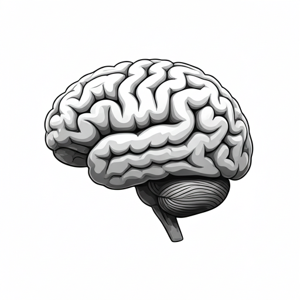

#### Welcome to the DiNicola Lab!
{: .display-4}
 
We are new to the [Department of Psychology at the University of Virgnia](https://psychology.as.virginia.edu/) !
{: .welcomefont}

<!-- {:style="max-width: 100%; height: auto;"} --> 

We study _how_ our brains support complex cognitive functions to better understand _why_ human minds are both flexible and vulnerable to psychopathology. We use a precision neuroscience approach to examine the organization & functions of humans' large-scale brain networks, as well as how those networks develop & change. 

This website is _under construction_ as of January 2026! Check back soon for an updated version. 

In the meantime, we are currently recruiting [Undergraduate Research Assistants](https://virginia.az1.qualtrics.com/jfe/form/SV_6FmneOT8Dr3H4dE)! Please complete the linked Qualtrics form, if of interest, and reach out with any questions.
For the spring, we plan to make hiring decisions by the end of April, so please submit your applications by April 15. 

{: .welcomefont}
